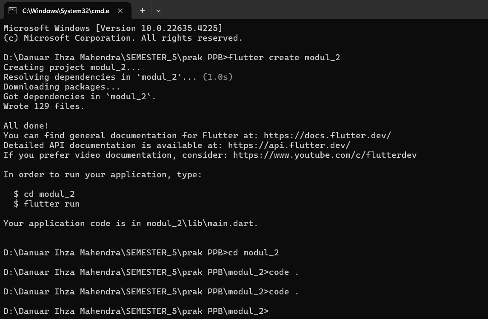
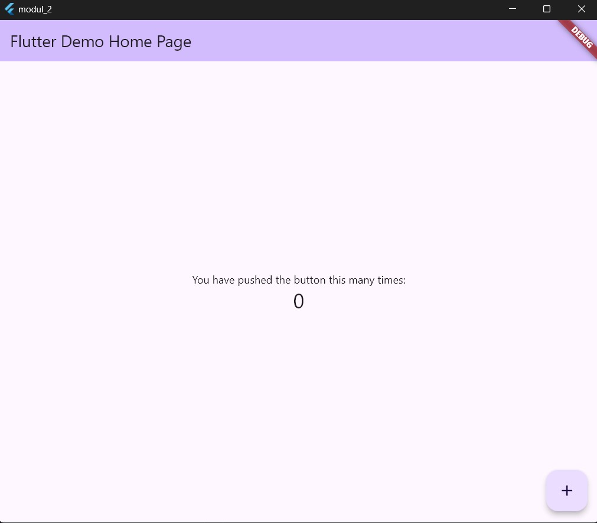
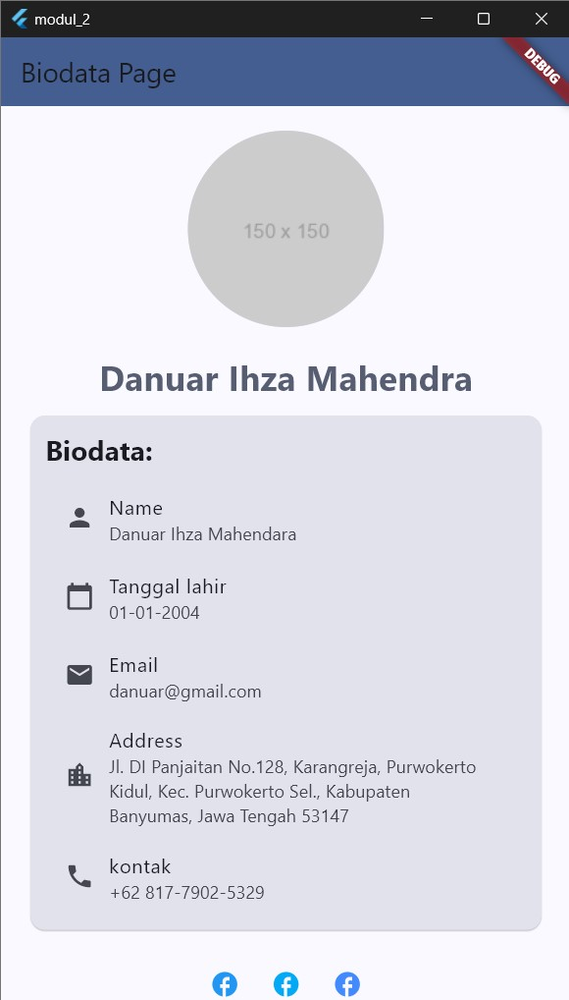

**LAPORAN PRAKTIKUM**  
**PEMOGRAMAN PERANGKAT BERGERAK**  
**MODUL II**  

Oleh: 
Danuar Ihza Mahendra 
2211104084 
S1SE-06-02 
 
 

**PRODI S1 REKAYASA PERANGKAT LUNAK**  
**FAKULTAS INFORMATIKA**  
**TELKOM UNIVERSITY PURWOKERTO**  
**2024**  

---

<h1>Tugas</h1>

### 1. Jelaskan apa itu Dart & Flutter beserta contoh widget yang ada pada Flutter
<h3> Dart </h3>
Adalah sebuah bahasa pemrograman yang di kembangkan oleh google dan digunakan untuk pengembangan aplikasi di berbagai platform.
 
<h3> Flutter </h3>
Adalah adalah cross-framework aplikasi mobile yang dikembangkan oleh google  untuk membangun antarmuka pengguna (UI) aplikasi secara native pada berbagai platform, seperti Android, iOS, Web, dan Desktop, menggunakan satu kode sumber (codebase). Dengan Flutter, pengembang dapat membuat aplikasi dengan tampilan yang konsisten dan performa tinggi tanpa perlu menulis kode yang berbeda untuk setiap platform. 
 
Dalam Flutter, hampir semua elemen antarmuka pengguna disebut widget. Berikut adalah beberapa jenis widget yang umum digunakan dalam pengembangan aplikasi Flutter : 
 

## 2. Buatlah sebuah project Flutter.

## 3. Setelah project dibuat, jalankan di emulator atau pada real device. Jika tampilan project Flutter muncul seperti gambar di bawah ini, maka project telah berhasil dijalankan.

## 4. Setelah berhasil, modifikasi halaman di atas untuk menampilkan biodata kalian, minimal 5 widget!! (bebas, buatlah sekreatif mungkin).

